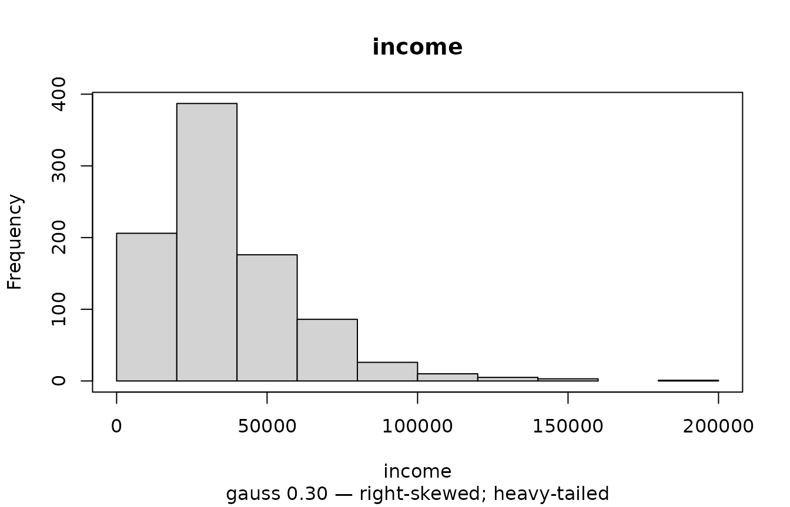
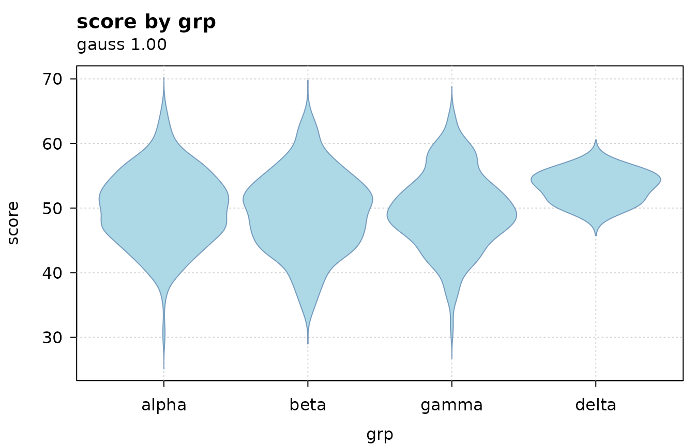
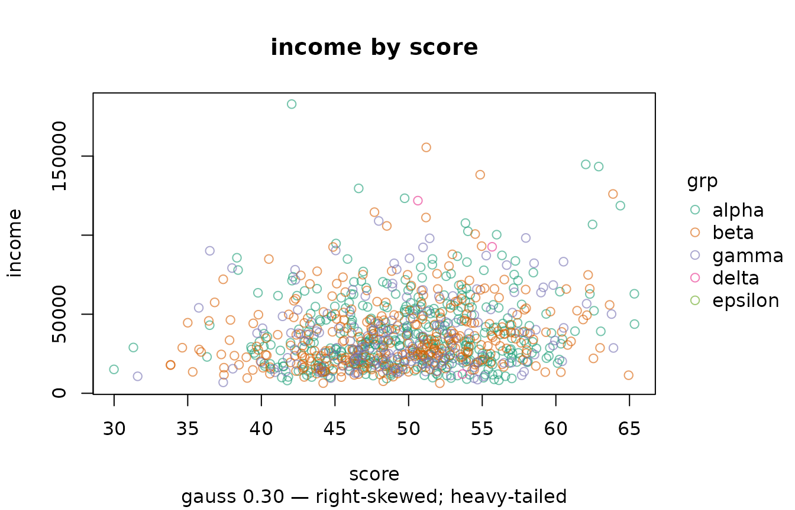
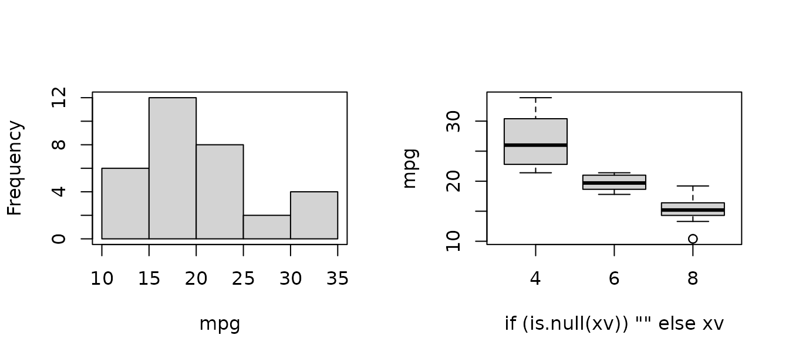

# Exploring data before you model it

## What this package is for

Most exploratory tools answer “what does this data look like”. `illumex`
asks a narrower question: **what about this data will break a model?**

That is a different emphasis, and it shows up everywhere in the output.
A factor summary reports how many levels are too thin to estimate,
because that is the usual reason a model fails to fit. A date summary
reports whether the spacing is regular, because an AR(1) term requires
it. A numeric summary reports how far the variable is from gaussian *and
why*, because the reason determines what you do next.

The functions share one prefix with `illume`, the modelling package this
one was split from and which attaches it, so exploring and fitting feel
like one workflow rather than two packages bolted together.

``` r

d <- ilm_sim()
dim(d)
#> [1] 900  13
```

[`ilm_sim()`](https://huttoncp.github.io/illumex/reference/ilm_sim.md)
generates a synthetic dataset for examples and tests. Every column is
there because some check should have something to say about it — a
fixture where nothing is wrong tests nothing.

## Describing everything at once

``` r

r <- ilm_describe_all(d)
names(r)
#> [1] "numeric"     "time"        "categorical" "logical"     "constant"
```

One table per class, because columns of different classes do not share a
sensible set of statistics. Constant columns are split out separately: a
variable with one value tells you nothing a statistic can show, and it
will break a model matrix.

``` r

r$numeric
#>    variable obs   n  na         sum      mean        sd      se      p0
#> 1        id 900 900   0    34200.00    38.000    21.661   0.722    1.00
#> 2     score 900 900   0    44709.09    49.677     5.880   0.196   29.99
#> 3    income 900 900   0 33361609.93 37068.455 22902.677 763.423 6356.18
#> 4    visits 900 900   0     2779.00     3.088     1.830   0.061    0.00
#> 5    claims 900 900   0     3773.00     4.192     4.657   0.155    0.00
#> 6  downtime 900 900   0     1339.00     1.488     2.386   0.080    0.00
#> 7 lab_value 900 792 108     5840.86     7.375     1.153   0.041    4.04
#>         p50      p100 p_zero dispersion gauss
#> 1    38.000     75.00  0.000     12.347 0.719
#> 2    49.835     65.34  0.000         NA 1.000
#> 3 31137.270 182886.22  0.000         NA 0.305
#> 4     3.000     10.00  0.053      1.085 0.042
#> 5     3.000     27.00  0.177      5.172 0.000
#> 6     0.000     11.00  0.640      3.826 0.000
#> 7     7.330     11.66  0.000         NA 1.000
#>                                                                                 gauss_note
#> 1                                                     bounded at zero; light-tailed / flat
#> 2                                                                                         
#> 3                                                               right-skewed; heavy-tailed
#> 4                                           discrete (11 distinct values); bounded at zero
#> 5 18% of values sit exactly at the minimum (0): a floor, see ilm_censor(); bounded at zero
#> 6                                           discrete (12 distinct values); bounded at zero
#> 7
```

Reading across: `p_zero` flags zero inflation, `dispersion` is the
variance-to-mean ratio for count-like variables, and `gauss` with
`gauss_note` say how far the variable is from normal and why.

``` r

r$constant
#>   variable       class obs   n na value
#> 1   cohort categorical 900 900  0  2024
```

## The gaussian index, and why it is not a p-value

`gauss` runs from 0 to 1. A value of 1 means the departure from
normality is no larger than sampling noise would produce at this sample
size.

``` r

ilm_gauss_check(rnorm(500))$gauss
#> [1] 0.98
ilm_gauss_check(rlnorm(500))$gauss
#> [1] 0
```

It deliberately is **not** a normality test p-value. Any test of exact
normality rejects everything once *n* is large, so the p-value ends up
answering a question nobody asked — you already know real data is not
exactly normal. What matters is *how far* from normal it is, which is an
effect size.

``` r

# a normality test would reject this; the index does not
ilm_gauss_check(rnorm(1e5))$gauss
#> [1] 1
```

The measure underneath is the Kolmogorov distance to the best-fitting
normal: the largest amount, on the cumulative probability scale, by
which a normal model misstates the data. Ask for it directly with
`gauss = "ks_d"` if you would rather apply your own threshold.

``` r

ilm_describe(d, "income", gauss = "both")[, c("gauss", "ks_d", "gauss_note")]
#>   gauss   ks_d                 gauss_note
#> 1 0.305 0.1134 right-skewed; heavy-tailed
```

### The reason matters more than the number

``` r

notes <- function(x) ilm_gauss_check(x)$gauss_note
notes(rlnorm(2000))
#> [1] "bounded at zero; right-skewed"
notes(rt(2000, 3))
#> [1] "heavy-tailed"
notes(rpois(2000, 3))
#> [1] "discrete (12 distinct values); bounded at zero"
notes(c(rnorm(1000), rnorm(1000, 5)))
#> [1] "multimodal (check for subgroups); light-tailed / flat"
```

That last one is the case worth dwelling on. A mixture of two normals is
**multimodal**, and the advice — check for subgroups — is what you
actually need. An earlier version of this feature tried to name the
single best-fitting distribution family instead, and on that data it
confidently answered “uniform”. It was not close to right, and it
offered nothing to act on.

## What the summaries are looking for

``` r

r$categorical[, c("variable", "n_empty", "n_unique", "n_rare", "n_unused",
                  "case_variants", "note")]
#>   variable n_empty n_unique n_rare n_unused case_variants
#> 1      grp       0        4      1        1             0
#> 2     site      46        6      0        0             1
#>                                               note
#> 1 1 unused levels; 1 rare levels (separation risk)
#> 2 46 empty strings (not NA); 1 case/space variants
```

Each of those columns exists because of a specific failure:

- `n_empty` — `""` is not `NA` to R, but it is almost always missing to
  you, and it silently becomes a factor level.
- `n_rare` — levels with only a handful of observations are the usual
  reason a factor model will not fit, and in a logistic model a direct
  route to separation.
- `n_unused` — a declared but unobserved level produces an all-zero
  column in the model matrix and then breaks
  [`predict()`](https://rdrr.io/r/stats/predict.html) on new data.
- `case_variants` — `"North"`, `"north"` and `"North "` counted as three
  things.

``` r

r$logical[, c("variable", "p_TRUE", "note")]
#>    variable p_TRUE                            note
#> 1      flag  0.510                                
#> 2 consented  0.998 near-constant (separation risk)
```

An indicator that is almost always `TRUE` is a separation risk in any
binary model.

### Dates carry the AR(1) precondition

``` r

r$time[, c("variable", "n_unique", "spacing", "regular", "n_gaps", "note")]
#>   variable n_unique spacing regular n_gaps
#> 1     date       12 monthly    TRUE      0
#>                                                       note
#> 1 repeated dates: 12 unique across 900 rows (long format?)
```

`regular` and `n_gaps` matter because `illume::ilm_model()`’s AR(1) term
needs regularly spaced observations within group. Seeing “irregular, 3
gaps” here is much better than discovering it when the model fails.

Repeated dates are *described* rather than warned about: many units
sharing a date is simply what long-format panel data looks like.

## Problems that belong to pairs of columns

Some problems are not properties of any single variable.

``` r

dd <- d
dd$score_copy <- dd$score
ilm_frame_issues(dd)
#>               issue            columns
#> 1          constant             cohort
#> 2 duplicate_columns score = score_copy
#> 3         collinear score ~ score_copy
#>                                      detail
#> 1    zero variance; breaks the model matrix
#> 2                          identical values
#> 3 r = 1.0000; coefficients will be unstable
```

Note that `score` is not reported as identifier-like even though every
value is distinct — a continuous variable is unique per row by
construction. Only discrete-valued columns earn that flag.

## Missingness

``` r

head(ilm_describe_na_all(d), 4)
#>    variable obs   n  na p_na
#> 1 lab_value 900 792 108 0.12
#> 2    claims 900 900   0 0.00
#> 3    cohort 900 900   0 0.00
#> 4 consented 900 900   0 0.00
```

Sorted with the most missing first, since those are the variables worth
looking at.

## Plots that carry the verdict

[`ilm_plot()`](https://huttoncp.github.io/illumex/reference/ilm_plot.md)
chooses a plot from the classes of what you give it, and annotates it
with the same verdict
[`ilm_describe()`](https://huttoncp.github.io/illumex/reference/ilm_describe.md)
reports.

``` r

ilm_plot(d, "income")
#> ilm_plot: gauss 0.30 — right-skewed; heavy-tailed
```



The subtitle is not decoration. A histogram of a skewed variable looks
like a histogram; the annotation says how far from gaussian it is and in
which direction.

You can ask what would be drawn without drawing it:

``` r

ilm_pick_geom(d$score)$geom
#> [1] "histogram"
ilm_pick_geom(d$grp, d$score)$geom
#> [1] "box"
```

### Rendering is aware of how much data there is

``` r

big <- data.frame(a = rnorm(50000), b = rnorm(50000))
ilm_pick_geom(big$a, big$b)
#> $geom
#> [1] "bin2d"
#> 
#> $reason
#> [1] "50000 points exceeds n_max = 5000, so density is drawn instead of points"
#> 
#> $n
#> [1] 50000
```

A scatter of fifty thousand points is a black rectangle. Above `n_max`
the plot becomes a binned density, and says so rather than misleading
you quietly.

``` r

ilm_plot(big, "a", "b")
#> ilm_plot: gauss 1.00  |  50000 points exceeds n_max = 5000, so density is drawn instead of points
```


### Choosing the geom yourself

``` r

ilm_geom_spec()
#>        geom needs_y                         x_class
#> 1 histogram   FALSE                         numeric
#> 2   density   FALSE                         numeric
#> 3       bar   FALSE           categorical / logical
#> 4       box    TRUE categorical / logical / numeric
#> 5    violin    TRUE categorical / logical / numeric
#> 6     point    TRUE                         numeric
#> 7     bin2d    TRUE                         numeric
#> 8      line    TRUE                  time / numeric
#> 9     spine    TRUE                     categorical
#>                           y_class     size_controls
#> 1                        not used line/border width
#> 2                        not used line/border width
#> 3                        not used line/border width
#> 4 numeric / categorical / logical line/border width
#> 5 numeric / categorical / logical line/border width
#> 6                         numeric        point size
#> 7                         numeric                 -
#> 8           numeric / categorical line/border width
#> 9                     categorical line/border width
```

That table is not just documentation — it is what the argument checks
read, so the documented requirements and the enforced ones cannot drift
apart. Ask for something impossible and the error says what would work:

``` r

ilm_plot(d, "grp", geom = "histogram")
#> Error:
#> ! geom 'histogram' needs `x` to be numeric, but 'grp' is categorical. Geoms that accept a categorical `x`: 'bar', 'box', 'violin', 'spine'.
```

### Appearance

Colours, fills, transparency, point size, palettes and themes are all
available, with ggplot2-style names:

``` r

ilm_plot(d, "grp", "score", geom = "violin", fill = "lightblue",
         alpha = 0.7, theme = "clean")
#> ilm_plot: gauss 1.00
```



``` r

ilm_plot(d, "score", "income", by = "grp", palette = "Dark 2", alpha = 0.6)
#> ilm_plot: gauss 0.30 — right-skewed; heavy-tailed
```



## Cleaning

``` r

messy <- data.frame(
  "Study ID"  = c("1", "2", "3", ""),
  someFlag    = c("TRUE", "FALSE", "TRUE", ""),
  measurement = c("1.5", "2.5", "n/a", ""),
  allEmpty    = c("", "", "", ""),
  check.names = FALSE, stringsAsFactors = FALSE)

ilm_wash_df(messy)
#>   study_id some_flag measurement
#> 1        1      TRUE         1.5
#> 2        2     FALSE         2.5
#> 3        3      TRUE         n/a
```

Names become snake_case, the empty row and column go, and text columns
that are really numeric or logical are converted. `measurement` stays
character on purpose: one value does not convert, and silently turning a
column into `NA`s is worse than leaving it alone.

Known-bad codes are handled separately, because a sentinel that means
missing in one column can be a real measurement in another:

``` r

ilm_recode_errors(data.frame(x = c(1, 999, 3), y = c(999, 2, 3)),
                  errors = 999, cols = "x")
#>    x   y
#> 1  1 999
#> 2 NA   2
#> 3  3   3
```

And recoding against a lookup table:

``` r

ilm_translate(c(1, 2, 3, 99), old = 1:3, new = c("low", "mid", "high"))
#> [1] "low"  "mid"  "high" NA
```

Unmatched values become `NA` rather than passing through, so codes your
dictionary does not cover cannot hide.

## Duplicates and counts

``` r

ilm_counts(d$grp)
#>   value   n
#> 1 alpha 404
#> 2  beta 329
#> 3 gamma 164
#> 4 delta   3
ilm_counts_tb(d$site, n = 2)
#>   top_value top_n bot_value bot_n
#> 1     North   277    North     46
#> 2     South   265              46
```

[`ilm_counts_tb()`](https://huttoncp.github.io/illumex/reference/ilm_counts_tb.md)
shows both ends at once because that is where the problems are: a level
that dominates, and levels too thin to model.

``` r

dup <- data.frame(a = c(1, 1, 2, 2, 2, 3), b = c("x", "x", "y", "y", "z", "w"))
ilm_copies(dup)
#>   a b copy_number n_copies
#> 1 1 x           1        2
#> 2 1 x           2        2
#> 3 2 y           1        2
#> 4 2 y           2        2
#> 5 2 z           1        1
#> 6 3 w           1        1
```

## Uncertainty without a model

``` r

ilm_boot_ci(d, "score", R = 500, seed = 1)
#>   stat observed    lower    upper conf   R    ci_type   n
#> 1 mean 49.67677 49.28963 50.03244 0.95 500 percentile 900
```

For a difference between two groups, ask for the difference directly:

``` r

d2 <- d[d$grp %in% c("alpha", "beta"), ]
d2$grp <- factor(d2$grp)
ilm_boot_diff(d2, "score", "grp", R = 500, seed = 1)
#>   stat group  from   to   observed     lower      upper conf   R    ci_type
#> 1 mean   grp alpha beta -0.7764371 -1.609053 0.03153625 0.95 500 percentile
#>   adjust n_comparisons n_from n_to p_value p_adj p_superiority excludes_zero
#> 1   none             1    404  329   0.052 0.052         0.026         FALSE
```

`excludes_zero` answers the question people actually ask. Comparing two
separate intervals for overlap is a conservative and lossy substitute:
two intervals can overlap while the difference is clearly non-zero.

Past two groups every pair is compared, and a formula works in place of
the two column names:

``` r

ilm_boot_diff(score ~ grp, data = d, R = 500, seed = 1)
#>   stat group  from    to   observed      lower     upper conf   R ci_type
#> 1 mean   grp alpha  beta -0.7764371 -1.8089638 0.2560897 0.95 500   max_t
#> 2 mean   grp alpha gamma -0.3748473 -1.6862971 0.9366025 0.95 500   max_t
#> 3 mean   grp alpha delta  3.3021040  0.3007192 6.3034887 0.95 500   max_t
#> 4 mean   grp  beta gamma  0.4015898 -0.9985315 1.8017111 0.95 500   max_t
#> 5 mean   grp  beta delta  4.0785410  1.0440608 7.1130212 0.95 500   max_t
#> 6 mean   grp gamma delta  3.6769512  0.5549078 6.7989947 0.95 500   max_t
#>   adjust n_comparisons n_from n_to p_value p_adj p_superiority excludes_zero
#> 1  max_t             6    404  329   0.054 0.236         0.026         FALSE
#> 2  max_t             6    404  164   0.500 0.920         0.232         FALSE
#> 3  max_t             6    404    3   0.000 0.022         1.000          TRUE
#> 4  max_t             6    329  164   0.508 0.918         0.746         FALSE
#> 5  max_t             6    329    3   0.000 0.004         1.000          TRUE
#> 6  max_t             6    164    3   0.000 0.012         1.000          TRUE
```

Six comparisons at a nominal 95% each do not jointly cover at 95%, so
the intervals are **simultaneous** by default: the groups are resampled
together, each comparison is standardised by its own bootstrap standard
error, and the largest standardised value in each replicate supplies one
critical value for all of them. On normal, equal-variance data this
reproduces [`TukeyHSD()`](https://rdrr.io/r/stats/TukeyHSD.html) to
about 0.006, without assuming either normality or a common variance. Set
`adjust = "none"` for comparisons chosen in advance, or
`adjust = "bonferroni"` to keep the shape of a percentile interval.

`ref` compares every level against one:

``` r

ilm_boot_diff(score ~ grp, data = d, ref = "alpha", R = 500, seed = 1)
#>   stat group  from    to   observed      lower     upper conf   R ci_type
#> 1 mean   grp alpha  beta -0.7764371 -1.7560509 0.2031767 0.95 500   max_t
#> 2 mean   grp alpha gamma -0.3748473 -1.6190904 0.8693959 0.95 500   max_t
#> 3 mean   grp alpha delta  3.3021040  0.4545284 6.1496795 0.95 500   max_t
#>   adjust n_comparisons n_from n_to p_value p_adj p_superiority excludes_zero
#> 1  max_t             3    404  329   0.054 0.186         0.026         FALSE
#> 2  max_t             3    404  164   0.500 0.900         0.232         FALSE
#> 3  max_t             3    404    3   0.000 0.014         1.000          TRUE
```

On skewed data, `"percentile"` and `"bca"` hold their nominal coverage
better than `"normal"` and `"basic"`. When the skew is severe and the
groups are small, no interval shape rescues a bootstrapped *mean* –
reach for `stat = "median"` instead, which stays nominal where the mean
does not.

## Unusual values

``` r

head(ilm_outliers_all(mtcars), 5)
#>   row_id variable   value score is_outlier
#> 1     31       hp 335.000 1.845       TRUE
#> 2     16       wt   5.424 1.602       TRUE
#> 3     17       wt   5.345 1.530       TRUE
#> 4      9     qsec  22.900 1.985       TRUE
#> 5     31     carb   8.000 2.000       TRUE
```

Three rules, in decreasing order of robustness. `"iqr"` is the Tukey
fence and reproduces exactly what a boxplot’s whiskers draw — it uses
Tukey’s hinges, not
[`quantile()`](https://rdrr.io/r/stats/quantile.html)’s default, which
matters on small samples and is pinned to
[`grDevices::boxplot.stats()`](https://rdrr.io/r/grDevices/boxplot.stats.html)
by a test. `"mad"` measures from the median in median absolute
deviations. `"zscore"` measures from the mean in standard deviations,
and is the weakest of the three for a reason worth seeing:

``` r

z <- c(rnorm(30), 100)
c(mad = max(ilm_outliers(z, "mad")$score),
  zscore = max(ilm_outliers(z, "zscore")$score))
#>     mad  zscore 
#> 101.639   5.382
```

One large value inflates the standard deviation enough to hide itself.
The median and the MAD are not dragged around by the values being
detected.

Grouping changes the answer, and usually should:

``` r

nrow(ilm_outliers_all(mtcars))
#> [1] 5
nrow(ilm_outliers_all(mtcars, by = "cyl"))
#> [1] 15
```

A value can be perfectly ordinary for its own group and extreme against
the pooled distribution, so flagging without `by` on grouped data partly
just rediscovers the groups.

**A flag is not a verdict.** It says a value is far from the others by
some rule — which may mean a typo, a different population, or an
ordinary draw from a heavy tail, and the third is common. Dropping
flagged rows because they are flagged changes what you are estimating.
If the tail is real, the fix is a model that expects it: a different
family, or `illume::ilm_model(dispformula = )`.

## Naming the plot you want

[`ilm_plot()`](https://huttoncp.github.io/illumex/reference/ilm_plot.md)
chooses a geometry from the data. When you would rather say which one,
each has its own function —
[`ilm_plot_histogram()`](https://huttoncp.github.io/illumex/reference/ilm_plot_histogram.md),
[`ilm_plot_density()`](https://huttoncp.github.io/illumex/reference/ilm_plot_density.md),
[`ilm_plot_box()`](https://huttoncp.github.io/illumex/reference/ilm_plot_box.md),
[`ilm_plot_violin()`](https://huttoncp.github.io/illumex/reference/ilm_plot_violin.md),
[`ilm_plot_scatter()`](https://huttoncp.github.io/illumex/reference/ilm_plot_scatter.md),
[`ilm_plot_bar()`](https://huttoncp.github.io/illumex/reference/ilm_plot_bar.md),
[`ilm_plot_line()`](https://huttoncp.github.io/illumex/reference/ilm_plot_line.md),
[`ilm_plot_stat_error()`](https://huttoncp.github.io/illumex/reference/ilm_plot_stat_error.md)
— and they all take column names as strings, like everything else here.

``` r

ilm_plot_c(
  ilm_plot_histogram(mtcars, "mpg"),
  ilm_plot_box(mtcars, "mpg", x = "cyl"),
  nrow = 1
)
```



[`ilm_plot_var_pairs()`](https://huttoncp.github.io/illumex/reference/ilm_plot_var_pairs.md)
handles every pair at once, mixed column types included, and
[`ilm_plot_var_all()`](https://huttoncp.github.io/illumex/reference/ilm_plot_var_all.md)
draws one panel per column.

The bootstrap difference from earlier can be seen rather than only
summarised:

``` r

b <- ilm_boot_diff(d, "score", "grp", R = 500, seed = 1)
ilm_plot_boot_diff(b, row = 1)
```


The interval says where the difference is. This says what the resampling
produced — whether it is symmetric, skewed, or piled against a boundary,
which the two endpoints cannot show.

## Profiling: what shape is this data set?

[`ilm_describe_all()`](https://huttoncp.github.io/illumex/reference/ilm_describe_all.md)
tells you about columns one at a time.
[`ilm_profile()`](https://huttoncp.github.io/illumex/reference/ilm_profile.md)
asks a different question – are there *kinds* of row here? – by reducing
the columns to a few dimensions, clustering on those, and then saying
what each cluster is.

``` r

cars <- mtcars
cars$cyl <- factor(cars$cyl)
cars$am  <- factor(cars$am)

p <- ilm_profile(cars, k_max = 5, B = 25, seed = 1)
cat(p$summary, sep = "\n\n")
#> Cluster 1 (n = 5, 15.6% of the data, stable) is characterised by dim 2 (high gear, low qsec).
#> 
#> Cluster 2 (n = 7, 21.9% of the data, moderate) is characterised by dim 3 (cyl, high carb); dim 2 (low gear, high qsec). 1 of its members sits close enough to another cluster to be uncertain.
#> 
#> Cluster 3 (n = 12, 37.5% of the data, stable) is characterised by dim 1 (cyl, high disp).
#> 
#> Cluster 4 (n = 8, 25.0% of the data, stable) is characterised by dim 1 (cyl, low disp); dim 3 (cyl, low carb).
```

The reduction picks its own method from the column types: PCA when they
are all numeric, multiple correspondence analysis when they are all
categorical, and a mixed method when both are present, as here.

Two things get reported that a bare cluster number does not give you.
**Stability** is a property of the cluster – resample the rows,
recluster, and see whether the same grouping comes back. **Ambiguity**
is a property of the row, from its silhouette width, and is independent
of cluster size: a point can sit on the boundary between two clusters
inside a large and perfectly stable one, which a size-based check would
never surface.

``` r

p$cluster$clusters
#>   cluster size  pct jaccard stability mean_silhouette anomalous
#> 1       1    5 15.6   0.766    stable           0.286     FALSE
#> 2       2    7 21.9   0.698  moderate           0.252     FALSE
#> 3       3   12 37.5   0.995    stable           0.675     FALSE
#> 4       4    8 25.0   0.822    stable           0.548     FALSE
```

A cluster is characterised by v-test, the same device `FactoMineR`’s
`catdes()` uses. It is a threshold rather than a test, and is documented
as one: the clusters were found from the very coordinates being tested,
so the usual sampling argument does not apply. What speaks to whether a
partition is real is the stability and silhouette figures above, not the
characterisation.

## Missing values

[`ilm_describe_na_all()`](https://huttoncp.github.io/illumex/reference/ilm_describe_na_all.md)
counts them. The harder question is whether they matter, and that has a
more useful answer than it usually gets.

``` r

set.seed(4)
n  <- 500
z  <- rnorm(n)
x  <- 0.6 * z + rnorm(n)
y  <- 0.5 * x + 0.3 * z + rnorm(n)
d2 <- data.frame(x = x, z = z, y = y)
d2$x[plogis(1.2 * z - 0.4) > runif(n)] <- NA   # missingness follows z

ilm_check_missing(d2, y = "y", verbose = FALSE)
#> <ilm_missing> 309 of 500 rows complete (61.8%)
#> 
#>   missing by variable
#>     x                       191   38.2%
#> 
#>   pattern: monotone (2 distinct)
#>   verdict: RELATED_TO_COVARIATES 
#>     related to covariates, not to the outcome: complete cases stay unbiased 
#> 
#>   does missingness depend on `y` once the others are held fixed?
#>     x                partial r = 0.044, p = 0.4
#> 
#>   strongest associations with missingness
#>     x                <- z                0.490
#>     x                <- y                0.216  (outcome)
#> 
#>   MNAR cannot be ruled out by any test; that needs a sensitivity analysis.
```

Note the verdict. Missingness here depends on `z` — so this is
emphatically not MCAR — and yet **complete-case analysis is unbiased**.
Dropping incomplete rows needs missingness to be independent of the
*outcome* given the covariates, which is far weaker than MCAR and is
satisfied here. Imputing would buy back some precision and nothing else.

That distinction is why the check asks the question conditionally.
Missingness driven by `z` is *marginally* associated with `y`, because
`y` depends on `z` too; reading the verdict off that marginal
association would send you off to impute for nothing.

Change what drives the missingness and the advice changes with it:

``` r

d3 <- d2
d3$x <- x
d3$x[plogis(1.0 * y - 0.4) > runif(n)] <- NA   # now it follows the outcome
ilm_check_missing(d3, y = "y", verbose = FALSE)$verdict
#> [1] "RELATED_TO_OUTCOME"
```

Measured over 200 replicates at about 40% missing, the coefficient on
`x` came back with a bias of 0.0001 and 98% interval coverage in the
first case, against a bias of −0.099 — a fifth of the effect — and 61.5%
coverage in the second.

### Imputing, when it is actually needed

Imputing and pooling are `illume`’s, because pooling needs a model. With
`illume` loaded:

``` r

imp <- ilm_impute(d3, m = 10, seed = 1, verbose = FALSE)
ilm_mi_pool(imp, y ~ x + z, family = "gaussian")
```

Each missing value is **drawn** from the predictive distribution rather
than set to a fitted mean, and the `m` completed data sets are pooled by
Rubin’s rules, where the spread of the estimates *across* imputations
becomes part of the reported uncertainty. `fmi` is the fraction of
information lost to missingness.

`single = TRUE` gives one completed data set and warns. Filling values
in once and analysing as though they had been observed gets the point
estimate about right and the standard errors badly wrong: in that same
simulation, single imputation covered 79% to 89% where the nominal rate
was 95%, because nothing in its standard errors knows part of the data
was invented.

### Which values go missing together

``` r

pn <- ilm_profile_na(airquality, k_max = 4, B = 25, seed = 1)
#> ilm_reduce_na(): dropping column(s) whose missingness never varies (always or never missing): Wind, Temp, Month, Day
#> Warning: k was chosen as 4, which is the largest value searched. The curve had
#> not turned, so this is where the search stopped rather than where the evidence
#> pointed. Raise `k_max`, or set `k` from what the design says. On mixed data a
#> selector can also lock onto the number of category combinations rather than the
#> number of clusters; plot(x) shows the gap curve.
cat(pn$summary[1:2], sep = "\n\n")
#> Cluster 1 (n = 35, 22.9% of the data, stable) is characterised by dim 2 (missing: Ozone, missing: Solar.R).
#> 
#> Cluster 2 (n = 2, 1.3% of the data, stable) is characterised by dim 1 (missing: Ozone, missing: Solar.R). It is a small cluster, 1.3% of observations: possibly a real minority pattern, possibly a data problem, but worth looking at either way.
```

The same reduce-cluster-describe pipeline, pointed at present/missing
indicators instead of values. A block of columns that go missing as one
points at a shared cause — a section of a form a whole group skipped —
which is a different problem from values going one at a time, and calls
for a different fix.

And the boundary of all this is worth stating plainly: **MAR and MNAR
cannot be told apart from the observed data.** That is a theorem, not a
gap in the implementation — the data that would separate them are the
ones that are missing. Everything above tests MCAR and describes what
missingness is related to among the things you can see. If the chance of
a value going missing depends on the value itself, no test will reveal
it, and the remedy is a sensitivity analysis rather than a better
diagnostic.

## Into the model

The point of all this is what comes next. The exploration tells you
which family to consider, which variables will cause trouble, and
whether an AR(1) term is even possible. The model is `illume`’s:

``` r

library(illume)
f <- ilm_model(score ~ income + grp + (1 | id), data = d,
               family = "gaussian", verbose = FALSE)
ilm_plot_model(f, "coef")
```

and, once it is fitted, what it says in words:

``` r

ilm_interpret(f, ame = FALSE)
```

See
[`vignette("profiling")`](https://huttoncp.github.io/illumex/articles/profiling.md)
for structure across many columns and
[`vignette("anomaly-detection")`](https://huttoncp.github.io/illumex/articles/anomaly-detection.md)
for rows that are implausible as combinations. In `illume`:
`vignette("workflow", package = "illume")` for where this sits in an
analysis, `vignette("regression-models", package = "illume")` for the
modelling, and `vignette("causal-models", package = "illume")` for
turning an association into a causal claim.
