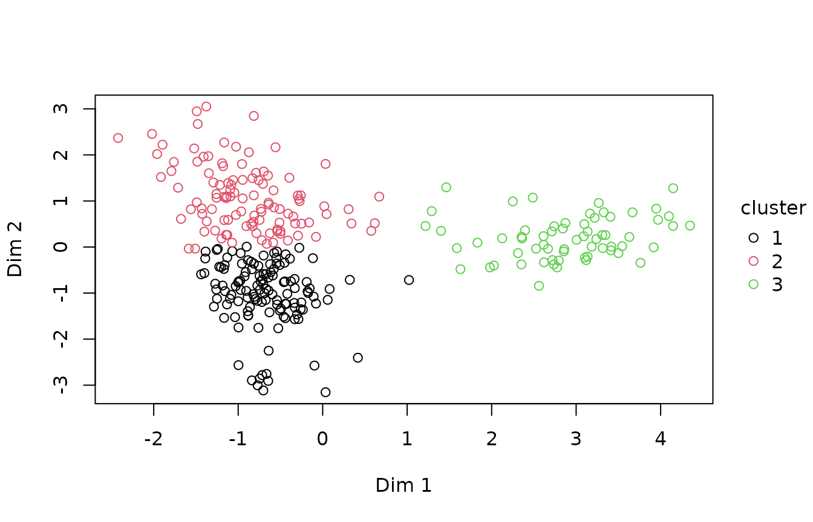
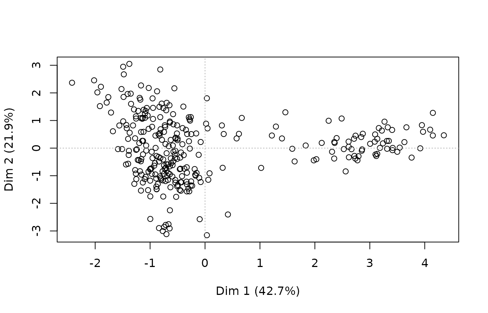
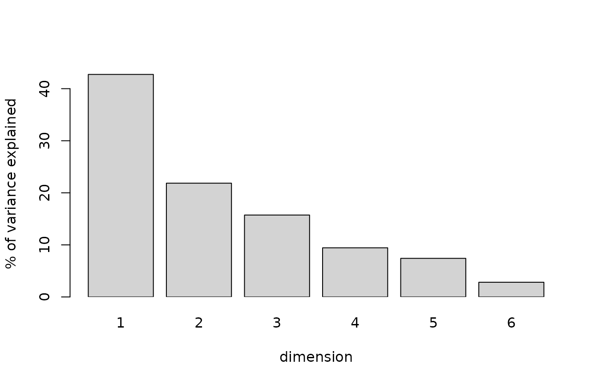
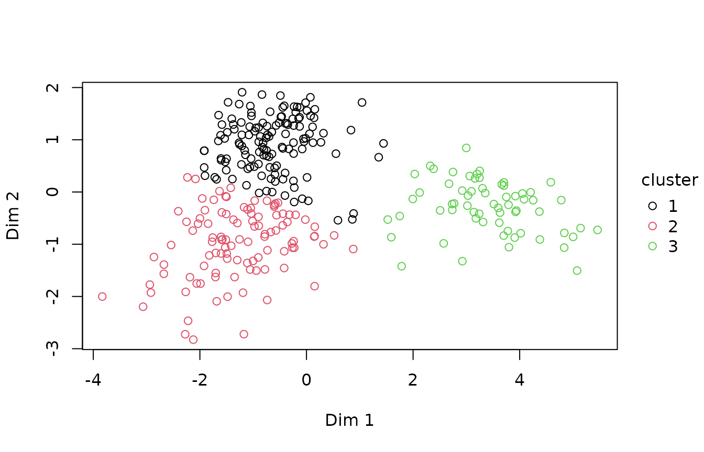
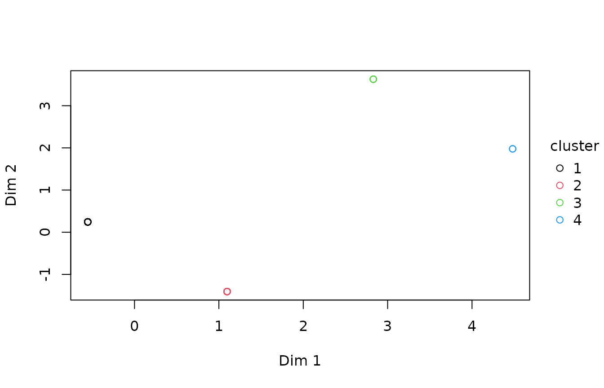

# Profiling: reduce, cluster, characterise

Three steps that are usually taken together: find the few directions a
set of correlated columns shares, group the rows in that space, and say
what distinguishes each group.

``` r

library(illumex)
```

The examples use simulated survey data: 300 people, with their age,
income, household size, number of visits and work, drawn so that younger
people on lower incomes, people on higher incomes in larger households,
and older people, mostly retired, who visit more often, are all in it –
though nothing in the data says who is which. To keep this page quick to
build, the clustering uses 25 resamples (`B`), where the default is 100.

Two dimensions are kept (`ndim = 2`). With five columns, the dimensions
past the first two mostly carry the levels of `work` on their own, and
the gap statistic then splits the groups along them: kept at five, it
chose 8 clusters here. Choose `ndim` from the scree plot below, not by
default.

``` r

set.seed(1)
n <- 300
g <- sample(1:3, n, TRUE, prob = c(0.4, 0.35, 0.25))
d <- data.frame(
  age = round(c(31, 47, 71)[g] + rnorm(n, 0, 6)),
  income = round(c(38, 72, 31)[g] + rnorm(n, 0, 9), 1),
  household = 1 + rpois(n, c(1.2, 2.4, 0.4)[g]),
  visits = rpois(n, c(2, 3, 6)[g]),
  work = factor(ifelse(runif(n) < c(0.9, 0.95, 0.15)[g], "employed",
                       ifelse(g == 3, "retired", "studying"))))
```

## The whole thing in one call

``` r

pr <- ilm_profile(d, ndim = 2, B = 25, seed = 1)
pr
#> <ilm_profile>
#> 
#> <ilm_reduce> method = famd, n = 300, 2 dimension(s) retained
#>   first 3 dimension(s) explain 80.3% of the variance
#> 
#>   strongest variable per dimension (squared loading)
#>     dim 1   work                     0.838
#>     dim 2   income                   0.406
#> 
#> <ilm_cluster> method = kmeans, k = 3 (chosen by gap statistic)
#> 
#>   cluster   size    pct  jaccard  stability     sil
#>         1    127   42.3    0.970     stable   0.543
#>         2    109   36.3    0.964     stable   0.460
#>         3     64   21.3    1.000     stable   0.700
#>   11 observation(s) sit between clusters (silhouette below 0.10) and may be misassigned
#> 
#>   what each cluster is
#>     Cluster 1 holds 127 rows, 42.3% of the data (stable). What sets it
#>     apart: age is lower: the middle 50% of its values lie between 28 and
#>     38, against 34 to 54 across all rows; visits is lower: the middle 50%
#>     of its values lie between 1 and 3, against 1 to 4 across all rows; work
#>     is 'retired' for none of them, against 19% across all rows; and income
#>     is lower: the middle 50% of its values lie between 30.7 and 45.5,
#>     against 31.4 to 66.4 across all rows. Less strongly, 1 more variable
#>     sets it apart as well. 2 of its members sit close enough to another
#>     cluster to be uncertain.
#> 
#>     Cluster 2 holds 109 rows, 36.3% of the data (stable). What sets it
#>     apart: income is higher: the middle 50% of its values lie between 61.9
#>     and 76.6, against 31.4 to 66.4 across all rows; household is higher:
#>     the middle 50% of its values lie between 2 and 5, against 1 to 3 across
#>     all rows; and work is 'employed' for 100% of them, against 75% across
#>     all rows. 9 of its members sit close enough to another cluster to be
#>     uncertain.
#> 
#>     Cluster 3 holds 64 rows, 21.3% of the data (stable). What sets it
#>     apart: work is 'retired' for 88% of them, against 19% across all rows;
#>     age is higher: the middle 50% of its values lie between 68 and 75,
#>     against 34 to 54 across all rows; visits is higher: the middle 50% of
#>     its values lie between 4 and 8, against 1 to 4 across all rows; and
#>     income is lower: the middle 50% of its values lie between 22 and 36.7,
#>     against 31.4 to 66.4 across all rows. Less strongly, 1 more variable
#>     sets it apart as well.
#> 
#>     ilm_var_contrib() for the full table.
ilm_plot_profile(pr)
```



[`ilm_profile()`](https://huttoncp.github.io/illumex/reference/ilm_profile.md)
runs
[`ilm_reduce()`](https://huttoncp.github.io/illumex/reference/ilm_reduce.md),
then
[`ilm_cluster()`](https://huttoncp.github.io/illumex/reference/ilm_cluster.md)
on the dimensions it produced, then characterises the clusters. The
three are also available separately, which is what you want as soon as
you disagree with one of its choices.

## Reducing

``` r

rr <- ilm_reduce(d, ndim = 2)
rr
#> <ilm_reduce> method = famd, n = 300, 2 dimension(s) retained
#>   first 3 dimension(s) explain 80.3% of the variance
#> 
#>   strongest variable per dimension (squared loading)
#>     dim 1   work                     0.838
#>     dim 2   income                   0.406
ilm_plot_reduce(rr)
```



``` r

ilm_plot_reduce_scree(rr)
```



``` r

ilm_plot_reduce_contrib(rr)
```


The method follows the column types without being told: PCA for
all-numeric data, multiple correspondence analysis for all-categorical,
and factor analysis of mixed data when both are present. All three are
the same decomposition with different scaling, which is why one function
covers them.

The number of dimensions available is `min(n - 1, p)` for PCA and the
mixed case, and the number of levels less the number of variables for
MCA. Asking for more than exist is an error rather than a smaller
answer, which is worth knowing because an earlier version computed that
ceiling as `p - 1` and failed outright on any two-column selection.

### A different loss per column

FAMD reaches mixed data by one-hot encoding the categories, scaling the
indicators and running PCA on the result. That is fast, has a closed
form, and treats a category as though it were Gaussian – a
reconstruction can come back at `-0.3`, which is not a category.

``` r

rr <- ilm_reduce(d, ndim = 2, method = "glrm", lambda = 2)  # lambda given: no search
```

A generalised low rank model keeps the low-rank structure and changes
the loss: quadratic for a numeric column, logistic for a binary one,
multinomial across the levels of a categorical one, Poisson for a count.
Each column is then reconstructed on its own scale, and a category comes
back as a category.

It costs an iterative fit where FAMD has a decomposition, so it is an
option rather than the default. On all-numeric data the two are the
*same model* – with quadratic loss everywhere and no penalty a GLRM is
principal components, verified against the SVD to 1e-16 – so there is
nothing to gain there. What it adds is mixed data, and
`illume::ilm_impute(method = "glrm")` uses the same machinery to impute
categorical columns.

See
[`?ilm_glrm`](https://huttoncp.github.io/illumex/reference/ilm_glrm.md)
for the ridge penalty, which is chosen by cross-validation because a
fixed value is wrong across sizes and missingness rates.

## Clustering

``` r

cl <- ilm_cluster(rr, B = 25, seed = 1)
cl
#> <ilm_cluster> method = kmeans, k = 3 (chosen by gap statistic)
#> 
#>   cluster   size    pct  jaccard  stability     sil
#>         1    132   44.0    0.954     stable   0.497
#>         2    104   34.7    0.944     stable   0.376
#>         3     64   21.3    0.998     stable   0.690
#>   19 observation(s) sit between clusters (silhouette below 0.10) and may be misassigned
ilm_plot_cluster(cl)
```



``` r

ilm_plot_cluster_gap(cl)
```


`k` is chosen by the gap statistic rather than by eye. The result also
reports what a cluster solution usually hides: how stable each cluster
is under resampling (bootstrap Jaccard), how many rows sit ambiguously
between two of them (silhouette width), and whether any cluster is too
small to be a finding.

A cluster that appears in 45% of bootstrap resamples is not a group, and
the output says so rather than leaving the reader to assume that
everything printed is solid.

## Characterising

The step people usually do by hand, badly. Each cluster is compared with
all rows on every variable the clustering used, and described in that
variable’s own units: a number by the middle 50% of its values against
everyone’s, a category by the value whose share in the cluster sits
furthest from its share among all rows, a date by the middle 50% of its
values and by any stretch of the week, month or year where the cluster
stands out.

``` r

cat(pr$summary, sep = "\n\n")   # a paragraph per cluster
#> Cluster 1 holds 127 rows, 42.3% of the data (stable). What sets it apart: age is lower: the middle 50% of its values lie between 28 and 38, against 34 to 54 across all rows; visits is lower: the middle 50% of its values lie between 1 and 3, against 1 to 4 across all rows; work is 'retired' for none of them, against 19% across all rows; and income is lower: the middle 50% of its values lie between 30.7 and 45.5, against 31.4 to 66.4 across all rows. Less strongly, 1 more variable sets it apart as well. 2 of its members sit close enough to another cluster to be uncertain.
#> 
#> Cluster 2 holds 109 rows, 36.3% of the data (stable). What sets it apart: income is higher: the middle 50% of its values lie between 61.9 and 76.6, against 31.4 to 66.4 across all rows; household is higher: the middle 50% of its values lie between 2 and 5, against 1 to 3 across all rows; and work is 'employed' for 100% of them, against 75% across all rows. 9 of its members sit close enough to another cluster to be uncertain.
#> 
#> Cluster 3 holds 64 rows, 21.3% of the data (stable). What sets it apart: work is 'retired' for 88% of them, against 19% across all rows; age is higher: the middle 50% of its values lie between 68 and 75, against 34 to 54 across all rows; visits is higher: the middle 50% of its values lie between 4 and 8, against 1 to 4 across all rows; and income is lower: the middle 50% of its values lie between 22 and 36.7, against 31.4 to 66.4 across all rows. Less strongly, 1 more variable sets it apart as well.
pr$characterization               # every comparison behind them
#>    cluster  variable aspect   kind           v       size eligible
#> 1        1       age        number -11.8545484 0.79881384     TRUE
#> 2        1    visits        number  -8.2588457 0.55651890     TRUE
#> 3        1      work         share  -8.1304991 0.18666667     TRUE
#> 4        1    income        number  -6.5955778 0.44444028     TRUE
#> 5        1 household        number  -4.2155813 0.28406520     TRUE
#> 6        2    income        number  13.7256112 1.04899761     TRUE
#> 7        2 household        number   9.9459608 0.76013293     TRUE
#> 8        2      work         share   8.6697403 0.24666667     TRUE
#> 9        2    visits        number  -0.8325940 0.06363208     TRUE
#> 10       2       age        number   0.1527781 0.01167627     TRUE
#> 11       3      work         share  15.2584513 0.68833333     TRUE
#> 12       3       age        number  14.1182581 1.56526006     TRUE
#> 13       3    visits        number  10.9383941 1.21271557     TRUE
#> 14       3    income        number  -8.1596097 0.90463788     TRUE
#> 15       3 household        number  -6.5926228 0.73090952     TRUE
#>                                                                                                       description
#> 1              age is lower: the middle 50% of its values lie between 28 and 38, against 34 to 54 across all rows
#> 2               visits is lower: the middle 50% of its values lie between 1 and 3, against 1 to 4 across all rows
#> 3                                                 work is 'retired' for none of them, against 19% across all rows
#> 4   income is lower: the middle 50% of its values lie between 30.7 and 45.5, against 31.4 to 66.4 across all rows
#> 5            household is lower: the middle 50% of its values lie between 1 and 3, against 1 to 3 across all rows
#> 6  income is higher: the middle 50% of its values lie between 61.9 and 76.6, against 31.4 to 66.4 across all rows
#> 7           household is higher: the middle 50% of its values lie between 2 and 5, against 1 to 3 across all rows
#> 8                                                work is 'employed' for 100% of them, against 75% across all rows
#> 9               visits is lower: the middle 50% of its values lie between 2 and 4, against 1 to 4 across all rows
#> 10            age is higher: the middle 50% of its values lie between 42 and 50, against 34 to 54 across all rows
#> 11                                                 work is 'retired' for 88% of them, against 19% across all rows
#> 12            age is higher: the middle 50% of its values lie between 68 and 75, against 34 to 54 across all rows
#> 13             visits is higher: the middle 50% of its values lie between 4 and 8, against 1 to 4 across all rows
#> 14    income is lower: the middle 50% of its values lie between 22 and 36.7, against 31.4 to 66.4 across all rows
#> 15           household is lower: the middle 50% of its values lie between 1 and 2, against 1 to 3 across all rows
pr$frequencies                    # every value of every category, per cluster
#>   cluster variable    value   n share share_all
#> 1       1     work employed 109 0.858     0.753
#> 2       1     work studying  18 0.142     0.060
#> 3       1     work  retired   0 0.000     0.187
#> 4       2     work employed 109 1.000     0.753
#> 5       2     work  retired   0 0.000     0.187
#> 6       2     work studying   0 0.000     0.060
#> 7       3     work  retired  56 0.875     0.187
#> 8       3     work employed   8 0.125     0.753
#> 9       3     work studying   0 0.000     0.060
pr$by_cluster                     # ilm_describe_all(), by cluster
#> $numeric
#>     variable cluster obs   n na    sum   mean     sd    se   p0  p50  p100
#> 1        age       1 127 127  0 4163.0 32.780  8.082 0.717 17.0 32.0  65.0
#> 2        age       2 109 109  0 5017.0 46.028  7.408 0.710 27.0 46.0  76.0
#> 3        age       3  64  64  0 4571.0 71.422  5.882 0.735 57.0 70.5  85.0
#> 11    income       1 127 127  0 4939.1 38.891 12.103 1.074 16.3 36.6  86.1
#> 21    income       2 109 109  0 7505.5 68.858 11.945 1.144 37.7 69.8 106.3
#> 31    income       3  64  64  0 1898.0 29.656 10.571 1.321  8.2 29.1  55.1
#> 12 household       1 127 127  0  255.0  2.008  0.972 0.086  1.0  2.0   5.0
#> 22 household       2 109 109  0  392.0  3.596  1.673 0.160  1.0  4.0   9.0
#> 32 household       3  64  64  0   85.0  1.328  0.592 0.074  1.0  1.0   4.0
#> 13    visits       1 127 127  0  229.0  1.803  1.380 0.122  0.0  2.0   6.0
#> 23    visits       2 109 109  0  333.0  3.055  1.815 0.174  0.0  3.0   8.0
#> 33    visits       3  64  64  0  403.0  6.297  2.729 0.341  1.0  6.0  13.0
#>    p_zero dispersion gauss
#> 1   0.000      1.993 1.000
#> 2   0.000      1.192 1.000
#> 3   0.000      0.484 1.000
#> 11  0.000         NA 0.931
#> 21  0.000         NA 0.641
#> 31  0.000         NA 1.000
#> 12  0.000         NA 0.000
#> 22  0.000         NA 0.127
#> 32  0.000         NA 0.000
#> 13  0.181      1.057 0.000
#> 23  0.055      1.078 0.168
#> 33  0.000      1.183 0.591
#>                                                                                                                                gauss_note
#> 1                                                                                                                                        
#> 2                                                                                                                                        
#> 3                                                                                                                                        
#> 11                                                                                                             right-skewed; heavy-tailed
#> 21                                                                                          departs from normal, no single dominant cause
#> 31                                                                                                                                       
#> 12                                                                                                           discrete (5 distinct values)
#> 22                                                                                              discrete (9 distinct values); left-skewed
#> 32 72% of values sit at the scale's lowest point (1): it cannot separate people there, see an ordinal model; discrete (4 distinct values)
#> 13                                                                                          discrete (7 distinct values); bounded at zero
#> 23                                                                                          discrete (9 distinct values); bounded at zero
#> 33                                                                                                          discrete (13 distinct values)
#> 
#> $categorical
#>   variable cluster obs   n na n_empty n_unique ordered p_max n_rare n_unused
#> 1     work       1 127 127  0       0        2   FALSE 0.858      0        1
#> 2     work       2 109 109  0       0        1   FALSE 1.000      0        2
#> 3     work       3  64  64  0       0        2   FALSE 0.875      0        1
#>   case_variants                 counts_tb                           note
#> 1             0 employed_109, studying_18                1 unused levels
#> 2             0              employed_109 2 unused levels; near-constant
#> 3             0    retired_56, employed_8                1 unused levels
```

The variables are ranked by a v-test – how far the cluster’s mean or
share sits from everyone’s, in standard errors of a subset that size –
and named, strongest first, when it clears 1.96 and the difference is
big enough to matter: 0.2 standard deviations for a number, 10
percentage points for a share. With many rows a chance difference clears
1.96 on its own, which is what the second bar is for. Variables that set
no cluster apart are said to, after the paragraphs.

That is what a cluster is for: “older, mostly retired, living alone or
in twos” is a finding, and “cluster 3” is not. The v-test ranks the
differences; it does not test them, since the clusters were found from
these same variables.

## What this is, and is not

This is a lighter-weight reimplementation of the `FactoMineR::HCPC()`
plus `catdes()` workflow, with the stability reporting that pipeline
does not do, and without the dependency. It is exploratory. The groups
it finds are descriptions of the sample rather than populations, and
treating a cluster label as a variable in a subsequent model – then
testing whether the clusters differ on the variables that defined them –
is circular.

If the question is whether a *known* grouping differs, that is a model,
and `illume`’s:

``` r

illume::ilm_model(y ~ group, data = d, family = "gaussian")
```

## Structure in the missingness

The same three steps run on the missingness pattern rather than the
values. In R’s `airquality`, two columns have missing values:

``` r

ilm_reduce_na(airquality)
#> ilm_reduce_na(): dropping column(s) whose missingness never varies (always or never missing): Wind, Temp, Month, Day
#> <ilm_reduce_na> method = mca, n = 153, 2 dimension(s) retained
#>   first 2 dimension(s) explain 100.0% of the variance
#> 
#>   strongest variable per dimension (squared loading)
#>     dim 1   Ozone                    0.511
#>     dim 2   Ozone                    0.489
pr_na <- ilm_profile_na(airquality, k_max = 4, B = 25, seed = 1)
#> ilm_reduce_na(): dropping column(s) whose missingness never varies (always or never missing): Wind, Temp, Month, Day
#> Warning: k was chosen as 4, which is the largest value searched. The curve had
#> not turned, so this is where the search stopped rather than where the evidence
#> pointed. Raise `k_max`, or set `k` from what the design says. On mixed data a
#> selector can also lock onto the number of category combinations rather than the
#> number of clusters; plot(x) shows the gap curve.
pr_na
#> <ilm_profile_na> (profiling the pattern of missing values)
#> 
#> <ilm_reduce_na> method = mca, n = 153, 2 dimension(s) retained
#>   first 2 dimension(s) explain 100.0% of the variance
#> 
#>   strongest variable per dimension (squared loading)
#>     dim 1   Ozone                    0.511
#>     dim 2   Ozone                    0.489
#> 
#> <ilm_cluster_na> method = kmeans, k = 4 (chosen by gap statistic)
#> 
#>   cluster   size    pct  jaccard  stability     sil
#>         1    111   72.5    1.000     stable   1.000
#>         2     35   22.9    1.000     stable   1.000
#>         3      5    3.3    1.000     stable   1.000  small
#>         4      2    1.3    1.000     stable   1.000  small
#> 
#>   7 observation(s) in a cluster holding less than 5% of the data
#> 
#>   what each cluster is
#>     Cluster 1 holds 111 rows, 72.5% of the data (stable). What sets it
#>     apart: Ozone is missing for none of them, against 24% across all rows.
#> 
#>     Cluster 2 holds 35 rows, 22.9% of the data (stable). What sets it
#>     apart: Ozone is missing for 100% of them, against 24% across all rows.
#> 
#>     Cluster 3 is too small to describe reliably: 5 rows, 3.3% of the data
#>     (stable). What sets it apart: Solar.R is missing for 100% of them,
#>     against 5% across all rows. It could be a real minority pattern or a
#>     data problem, and is worth looking at either way.
#> 
#>     Cluster 4 is too small to describe reliably: 2 rows, 1.3% of the data
#>     (stable). What sets it apart: Solar.R is missing for 100% of them,
#>     against 5% across all rows. It could be a real minority pattern or a
#>     data problem, and is worth looking at either way.
ilm_plot_profile_na(pr_na)
```



A questionnaire where income and savings go missing together, and
separately from the health block, has structure in its non-response.
Knowing that before choosing an imputation strategy is worth more than
most of what the imputation then does.

## See also

[`?ilm_reduce`](https://huttoncp.github.io/illumex/reference/ilm_reduce.md),
[`?ilm_cluster`](https://huttoncp.github.io/illumex/reference/ilm_cluster.md),
[`?ilm_profile`](https://huttoncp.github.io/illumex/reference/ilm_profile.md),
[`?ilm_glrm`](https://huttoncp.github.io/illumex/reference/ilm_glrm.md),
[`vignette("anomaly-detection")`](https://huttoncp.github.io/illumex/articles/anomaly-detection.md)
for rows that fit no group, and
`vignette("missing-data", package = "illume")`.
